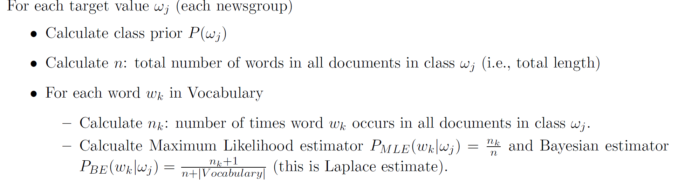
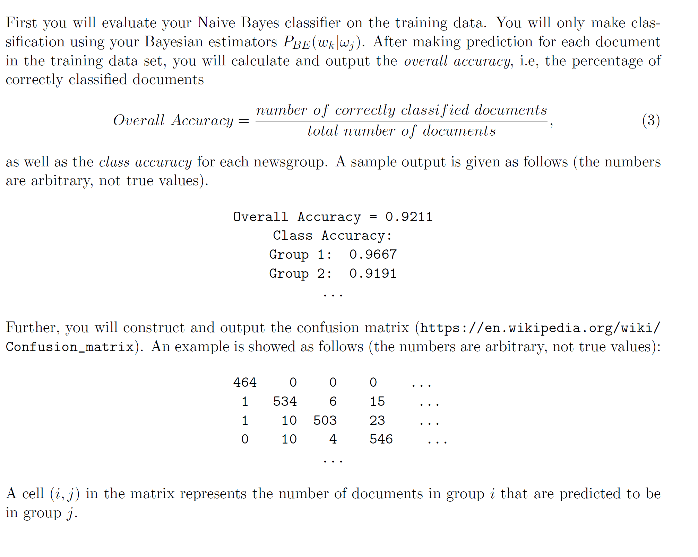

Points: 1) This is a lab assignment which requires code to implement the Naive Bayes algorithm. You are not allowed to use the existing implementation in machine learning packages. However, if you wish, you may use machine learning packages such as WEKA to check the correctness of your results.
2) The parts of the code which reads the file and calculates parameters required for calculating probability distributions is the same for all three program files.
3)NaiveBayes_BETEST is the code for calculating bayesian estimates on test data, NaiveBayes_BETRAIN is the code for calculating bayesian estimates for train data and NaiveBayes_MLETEST is the code for calculating maximum likelihood estimates on test data.
4)All other material required for the code to run is included here.

Naive Bayes classifiers have been successfully applied to classifying text documents. This is a lab assignment and you will implement the Naive Bayes algorithm to solve the "20 Newsgroups" classification problem.

1 Data Set
The 20 Newsgroups data set is a collection of approximately 20,000 newsgroup documents, partitioned (nearly) evenly across 20 different
newsgroups. It was originally collected by Ken Lang, probably for his Newsweeder: Learning to filter netnews[1] paper, though he did not
explicitly mention this collection. The 20 newsgroups collection has become a popular data set for experiments in text applications of
machine learning techniques, such as text classification and text clustering. The data is organized into 20 different newsgroups, each
corresponding to a different topic. Here is a list of the 20 newsgroups:
alt.atheism
comp.graphics
comp.os.ms-windows.misc
comp.sys.ibm.pc.hardware
comp.sys.mac.hardware
comp.windows.x
misc.forsale
rec.autos rec.motorcycles
rec.sport.baseball rec.sport.hockey
sci.crypt
sci.electronics
sci.med
sci.space
soc.religion.christian
talk.politics.guns
talk.politics.mideast
talk.politics.misc
talk.religion.misc

The original data set is available at http://qwone.com/~jason/20Newsgroups/. In this lab, you won't need to process the original data
set. Instead, a processed version of the data set is provided (see 20newsgroups.zip).

This processed version represents 18824 documents which have been divided to two subsets: training (11269 documents) and testing (7505
documents). You will find six files: map.csv, train label.csv, train data.csv, test label.csv, test data.csv, vocabulary.txt. The
vocabulary.txt contains all distinct words and other tokens in the 18824 documents. traindata.csv and testdata.csv are formatted
"docIdx, wordIdx, count", where docIdx is the document id, wordIdx represents the word id (in correspondence to vocabulary.txt) and
count is the frequency of the word in the document. trainlabel.csv and testlabel.csv are simply a list of label ids indicating which
newsgroup each document belongs to. The map.csv maps from label ids to label names.

2 What You Will Do

Learn your Naive Bayes classifier from the training data (trainlabel.csv, traindata.csv), then evaluate its performance on the
testingdata (testlabel.csv, testdata.csv). Specifically, your program will accomplish the following two tasks. 

2.1 Learn Naive Bayes Model

You will implement the multinomial model ("a bag of words" model) and in the learning phase estimate the required probability terms
using the training data.

2.2 Evaluate the Performance of the Classifier

2.2.1 Performance on training data

2.2.2 Performance on Testing Data

Now you will evaluate your classifiers on the testing data set. First, repeat the experiments described in Section 2.2.1 on testing dataset. Compare the results obtained with the results you have obtained in Section 2.2.1

Next repeat the experiments (on testing data) using your Maximum Likelihood estimator code instead of the Bayesian estimators. Compare your results to the results obtained using your Bayesian estimators.

2.3 Summary

In summary your program will output the following relevant chracteristics:

1. Class priors
2. Performance on training data (using Bayesian estimators): overall accuracy, class accuracy, confusion matrix.
3. Performance on testing data (using both MLE and BE estimators): overall accuracy, class accuracy, confusion matrix for MLE, overall accuracy, class accuracy, confusion matrix for BE.

References

[1] Ken Lang, Newsweeder: Learning to filter netnews, Proceedings of the Twelfth International Conference on Machine Learning, 331-339 (1995).
